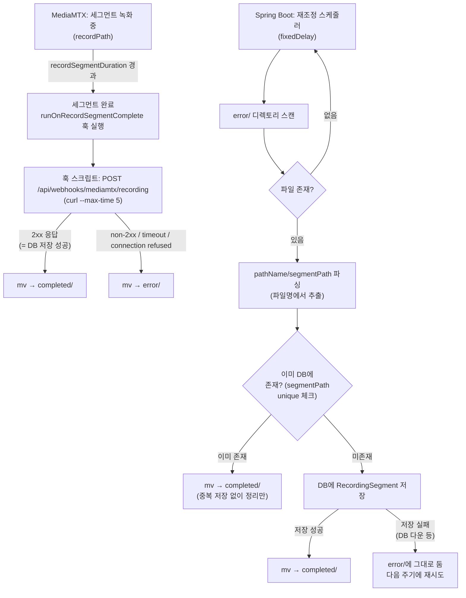

# 녹화 웹훅 신뢰성 개선 설계

## 배경 및 목표

[`2026-07-13-mediamtx-recording-design.md`](./2026-07-13-mediamtx-recording-design.md)에서 구현한 녹화 파이프라인은 `runOnRecordSegmentComplete` 훅이 Spring Boot 웹훅(`POST /api/webhooks/mediamtx/recording`)을 호출해 DB에 세그먼트 메타데이터를 저장하는 구조다. 이 훅은 **fire-and-forget, at-most-once**라 재시도가 없다 — 녹화 진행 중 Spring Boot가 비정상 종료되거나 일시적으로 응답 불가 상태이면 웹훅이 유실되고, MediaMTX는 여전히 디스크에 파일을 쓰지만 DB에는 해당 세그먼트가 기록되지 않아 **디스크와 DB 간 정합성이 깨진다.**

목표:
- 웹훅 실패 시에도 세그먼트 메타데이터가 결국은(eventually) DB에 반영되도록 보장한다.
- 실패 감지/복구 로직이 전체 녹화 파일을 주기적으로 훑는(O(전체 파일 수)) 방식이 되지 않도록 한다 — 실패한 것만 다시 처리하는 구조로 제한한다.
- 새 인프라(메시지 브로커 등)를 추가하지 않고, 파일시스템의 원자적 `rename` 연산만으로 신뢰성을 확보한다.

## 핵심 아이디어: 디렉토리 상태 전이 (Maildir 패턴)

메타데이터를 별도 큐 파일(JSON 등)에 기록해 관리하는 대신, **세그먼트 파일 자체의 위치가 처리 상태를 나타내도록** 한다. 메일 서버가 `new/` → `cur/` → `tmp/`로 파일을 원자적으로 이동시켜 락 없이 안전한 큐를 구현하는 Maildir 패턴과 동일한 원리다. `mv`(rename)는 같은 파일시스템 내에서 POSIX 원자적 연산이므로, 동시에 여러 세그먼트가 완료되어도 파일 단위로 안전하게 상태 전이가 가능하고 별도의 락이나 동시쓰기 충돌 처리가 필요 없다.

## 디렉토리 구조

```
mediamtx/recordings/
├── recording/
│   └── test_2026-07-14_10-00-00-000000.mp4   # 녹화중 (파일명에 pathName 포함)
├── completed/
│   └── test_2026-07-14_10-00-00-000000.mp4   # 완료 — DB에 반영된 세그먼트만 존재
└── error/
    └── test_2026-07-14_10-05-00-000000.mp4   # 에러 — 웹훅 실패로 아직 DB 미반영
```

pathName별 하위 디렉토리를 따로 두지 않고, 파일명 자체에 pathName을 포함시켜(`{pathName}_{timestamp}.mp4`) 평평한 구조로 둔다. 부수적으로, pathName이 더 이상 디렉토리명으로 쓰이지 않으므로 사용자가 MediaMTX 경로 이름을 우연히 `completed`나 `error`로 짓더라도 상태 디렉토리와 이름이 충돌할 일이 없다.

- **녹화중(`recording/`)**: MediaMTX가 세그먼트를 직접 쓰는 위치.
- **완료(`completed/`)**: 웹훅 처리(즉시 성공이든, 재조정을 통한 지연 성공이든)를 거쳐 **DB에 반영이 확정된** 세그먼트만 존재. 추후 HLS/m3u8 재생 기능은 이 디렉토리만 참조하면 된다 — "완료 디렉토리 = 재생 가능"이라는 단일 불변식이 성립한다.
- **에러(`error/`)**: 웹훅 실패로 DB 미반영 상태인 세그먼트의 임시 대기 공간. 정상 상황에서는 비어있거나 매우 작아야 한다.

> 위 트리에 쓰인 `test`나 정확한 파일명 포맷은 구조를 설명하기 위한 예시일 뿐이다. 핵심은 "녹화중/완료/에러 3분할 + 평평한 구조"라는 아키텍처 자체이며, 실제 base 경로(디렉토리 이름)는 설정 파일에서 조정 가능하도록 둔다. 구체적인 설정 키 이름은 구현 시 정한다.

## 처리 흐름



## 왜 "웹훅 시도 전 헬스체크"가 아니라 "웹훅 시도 후 결과 분기"인가

헬스체크를 먼저 하고 결과에 따라 웹훅 여부를 결정하면 헬스체크와 실제 웹훅 호출 사이에 서버 상태가 바뀔 수 있는 TOCTOU(Time-Of-Check to Time-Of-Use) 레이스가 생긴다. 대신 **웹훅을 그냥 시도하고, `curl`의 HTTP 응답 코드로 성공/실패를 판단**한다. 호출이 한 번으로 줄고, 판단 시점과 실제 상태가 항상 일치한다.

기존 구현이 이미 모든 예외를 4xx/5xx로 매핑해 응답하므로, DB 저장이 실패하면 웹훅 응답도 자연히 실패(non-2xx)로 내려온다 — 별도 판단 로직 추가 없이 "2xx = DB 저장 확정"이라는 기준을 그대로 쓸 수 있다.

## 정합성 보장: "DB 저장 → 파일 이동" 순서 고정

재조정 스케줄러가 각 실패 세그먼트를 처리할 때, **반드시 DB 저장을 먼저 성공시킨 뒤에 파일을 이동**시켜야 한다. 순서를 반대로 하면(파일 먼저 이동) 이동 직후 크래시가 나면 파일은 완료 디렉토리에 있지만 DB에는 기록이 없는, **재조정 스캔 대상에서 영원히 벗어난(=다시는 감지 불가능한) 상태**가 된다.

DB 저장을 먼저 하면, 저장 후 이동 전에 크래시가 나도 파일은 여전히 `error/`에 남아있어 다음 스케줄 주기에 다시 감지된다. 이때 같은 세그먼트를 중복 저장하지 않도록 `RecordingSegment.segmentPath`에 **unique 제약**을 걸고, 저장 전에 `existsBySegmentPath` 체크(또는 저장 시 unique violation을 잡아 무시)로 멱등성을 확보한다. 즉 이 설계는 "적어도 한 번은 저장됨(at-least-once)"을 보장하고, unique 제약으로 "정확히 한 번만 반영됨"으로 좁힌다.

## 스케줄링/타임아웃 관련 고려사항

- 훅 스크립트의 `curl`에는 반드시 `--max-time`(예: 5초) 같은 타임아웃을 걸어야 한다. 그렇지 않으면 Spring Boot가 응답 없이 걸려있는 상태(예: 스레드풀 고갈)에서 훅 프로세스가 무한정 대기하게 될 수 있다.
- 재조정 스케줄러 주기는 `recordSegmentDuration`(현재 1분)보다 짧게 잡을 필요는 없다 — 실시간성이 중요한 게 아니라 "결국 반영됨"이 목표이므로, 예를 들어 30초~1분 주기면 충분하다.
- `error/` 디렉토리는 정상 상황에서 항상 비어있거나 매우 작아야 한다(웹훅이 거의 항상 성공하므로). 만약 이 디렉토리가 계속 쌓인다면 그 자체로 "Spring Boot가 지속적으로 다운되어 있다"는 강한 신호이므로, 추후 모니터링/알림 지점으로 활용 가치가 있다(이번 스코프에서는 구현하지 않음).

## 범위 밖 (Out of scope)

- 훅 스크립트 자체의 재시도(backoff 포함 curl 재시도) — 현재는 1회 시도 후 바로 실패 처리. 필요시 추후 추가 검토.
- 여러 MediaMTX 인스턴스가 같은 `error/` 디렉토리를 공유하는 경우의 충돌 방지(인스턴스별 하위 디렉토리 분리 등) — 현재 단일 인스턴스 전제.
- `error/` 적체에 대한 알림/모니터링.
- 파일시스템 자체 장애(디스크 풀, 권한 문제)로 `mv`가 실패하는 경우 — 로그만 남기고 별도 복구 로직은 만들지 않는다.
- Kafka 등 메시지 브로커 기반 대안(설계 논의 과정에서 검토했으나, 새 인프라 없이 파일시스템 원자성만으로 해결 가능하다고 판단해 채택하지 않음).
